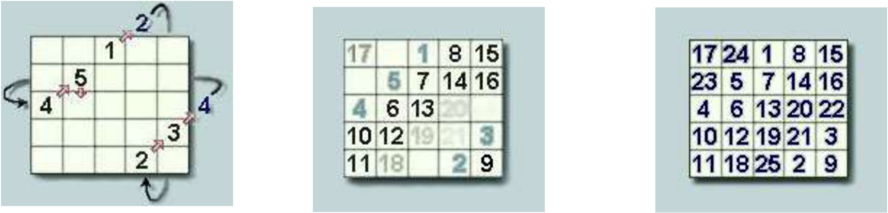

# Homework 2 - Magic Square

A magic square is a square array of numbers consisting of the distinct positive integers 1, 2, ..., n^2 arranged such that the sum of the n numbers in any horizontal, vertical, or main diagonal line is always the same number, known as the magic constant.

## Steps

1. Put the first number in the middle column of the top row.
2. Put the next number in the box moved one column to the right and one row up.

If the number exceeds a column or a row, place it in the opposite side of that column or row.

3. Repeat step 2 'n' times just before you reach the original starting position.
4. Place the next number in the same column one row below the last number and continue with step 2.

Basically, you're placing the numbers in consecutive order diagonally up and to the right until all spaces are filled.

<!-- Import the Magic Square Example picture from the folder src-->
